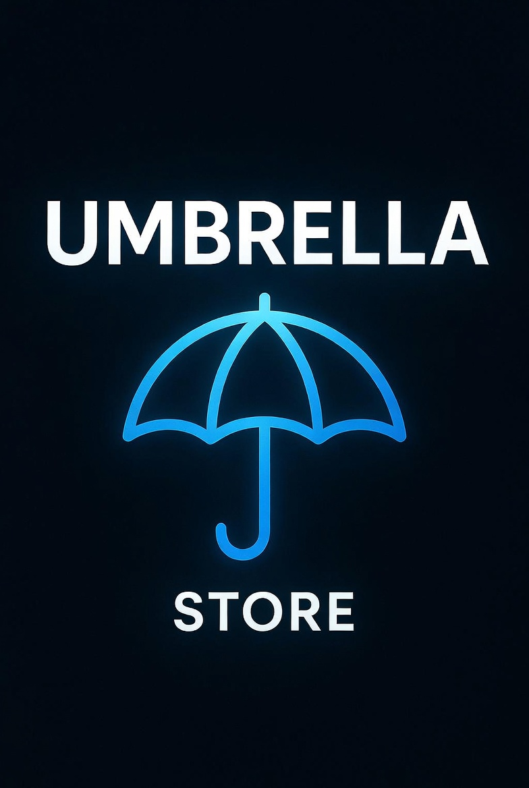

# Umbrella Store 1.0.0

<p align="center">
  
</p>

Umbrella Store is a next-generation SourceMod store suite built completely from scratch for modern servers, combining persistent credits, inventory, chat customization, player skins, and modular casino systems under one shared core.

Unlike many public store systems still circulating in the SourceMod scene, Umbrella Store is not a patched legacy fork. It was designed from the ground up as a modern modular foundation with cleaner ownership rules, explicit persistence behavior, safer production defaults, and a core made to support long-term growth.

Umbrella Store is also built for expansion. Third-party plugins can integrate with the core through the public API exposed in `umbrella_store.inc`, making it possible for other developers to build their own modules, casino games, and extensions on top of the same shared credits, inventory, and menu ecosystem.

## Why Umbrella Store

- Built from scratch instead of being another patched legacy store fork
- Designed as a real modular platform, not a monolithic plugin dump
- Shared persistent economy handled by one core plugin
- Public API for third-party modules and casino integrations

## Included modules

- `store_core`
- `store_blackjack`
- `store_camera`
- `store_coinflip`
- `store_crash`
- `store_daily`
- `store_giveaway`
- `store_roulette`

## Module overview

### `store_core`

The central economy and inventory plugin. It manages credits, persistence, item ownership, item equip state, player skins, chat items, store menus, trading, gifting, and the public API used by external modules.

### `store_blackjack`

A full blackjack module with solo play, PvP challenges, and multiplayer table mode. It is built on top of the shared Umbrella Store economy and supports its own menus, translations, sounds, and betting rules.

### `store_camera`

A utility module that adds thirdperson, firstperson, and mirror camera commands. It is designed to fit naturally into the store ecosystem while staying lightweight and easy to configure.

### `store_coinflip`

A coinflip betting module with both house play and PvP challenges. It supports configurable animation, sounds, limits, announcements, and shared credit handling through the core.

### `store_crash`

A global crash-style casino module with round countdowns, live multiplier growth, cashout support, low-crash rounds, and rare epic surge rounds. It is designed to feel active and readable while staying safe for production use.

### `store_daily`

A daily reward module tied directly into the Umbrella Store economy. It supports streak scaling, cooldown windows, and core-driven database behavior.

### `store_giveaway`

A giveaway/raffle module for distributing credits to players with animated winner selection, configurable sounds, and admin-controlled access.

### `store_roulette`

A roulette module with color bets, number bets, configurable payouts, sounds, and HUD-based spin animation. It uses the same shared credit system as the rest of the suite.

## Main features

- Persistent credits and inventory
- Buy, sell, gift, and trade support
- Chat tags, name colors, and chat colors
- Player skins with optional arms models
- Daily rewards
- Coinflip
- Crash
- Roulette
- Blackjack
- Giveaway
- Thirdperson and mirror camera tools
- Public API for external modules
- Casino registration support through the shared core

## Repository layout

- `addons/sourcemod/plugins`:
  compiled `.smx` plugins
- `addons/sourcemod/scripting`:
  SourcePawn `.sp` source files
- `addons/sourcemod/scripting/include/umbrella_store.inc`:
  native include for modules that integrate with the core
- `addons/sourcemod/translations`:
  all Umbrella Store phrase files
- `addons/sourcemod/configs/umbrella_store/umbrella_store_items.txt`:
  item definitions and examples

## API and module development

Umbrella Store exposes a public include:

- `addons/sourcemod/scripting/include/umbrella_store.inc`

This lets external plugins interact with the store core instead of duplicating economy logic.

Available native integrations include:

- player loaded-state checks
- credits get/set/add/take
- item ownership queries
- give/remove item operations
- casino/module registration into the shared store menu

This makes it possible to create custom modules on top of Umbrella Store without editing the core plugin directly.

### API example

```c
#include <sourcemod>
#include <umbrella_store>

public void OnPluginStart()
{
    US_Casino_Register("my_casino", "My Casino", "sm_mycasino");
}

public Action Command_MyCasino(int client, int args)
{
    if (!US_IsLoaded(client))
    {
        return Plugin_Handled;
    }

    if (US_GetCredits(client) >= 100)
    {
        US_TakeCredits(client, 100);
    }

    return Plugin_Handled;
}
```

That same API can also be used to:

- give and remove items
- open the shared casino menu
- build custom credit-based modules without rewriting the economy layer

## Compatibility notes

- Chat formatting is kept compatible with standard Source chat output
- Extended chat colors can be enabled, with auto-fallback for unknown engines
- The package is intended to be usable on CS:S, TF2, L4D2, and other Source engine games, but those targets still need more testing
- `store_camera` depends on thirdperson behavior being allowed by the game/server

## Requirements

- SourceMod
- SQL or MySQL database, depending on your chosen setup

## Tested games

Primary tested targets:

- Counter-Strike: Global Offensive

Umbrella Store is designed to be compatible with Source engine games in general, and other Source games should work as well, but they have not been fully tested yet.

## Installation

1. Copy the `addons` folder into your server.
2. Make sure your database entry exists in `addons/sourcemod/configs/databases.cfg`.
3. Load the plugins once so SourceMod generates the cfg files automatically.
4. Edit the generated `umbrella_store_*.cfg` files inside `addons/sourcemod/cfg/sourcemod`.
5. Edit `addons/sourcemod/configs/umbrella_store/umbrella_store_items.txt` with your real items.
6. Restart the server or reload the plugins.

## Database setup

The only cvar that controls the database entry is:

- `store_database`

That cvar belongs to `store_core` and should point to an entry inside `addons/sourcemod/configs/databases.cfg`.

Example:

```cfg
"Databases"
{
    "store"
    {
        "driver"    "mysql"
        "host"      "127.0.0.1"
        "database"  "store"
        "user"      "your_user"
        "pass"      "your_password"
    }
}
```

## Player commands

### Core

- `!store`, `!tienda`
- `!credits`, `!creditos`
- `!topcredits`
- `!inv`, `!inventory`, `!inventario`
- `!gift`, `!regalar`
- `!trade`, `!tradear`

### Blackjack

- `!blackjack`
- `!bj`

Notes:

- supports solo play
- supports PvP from the menu
- supports multiplayer table mode

### Camera

- `!tp`
- `!thirdperson`
- `!mirror`
- `!fp`
- `!firstperson`

### Coinflip

- `!coinflip`
- `!cf`
- `!coinflipvs`
- `!cfvs`
- `!coinflipaccept`
- `!cfa`
- `!coinflipdeny`
- `!cfd`

### Crash

- `!crash`

### Daily

- `!daily`
- `!diario`

### Giveaway

- `!giveaway`
- `!giveawaycancel`

### Roulette

- `!roulette`
- `!ruleta`
- `!ru`

## Admin commands

### Core

- `sm_givecredits`
- `sm_setcredits`
- `sm_storeaudit`
- `sm_reloadstore`

By default these use root access.

### Giveaway

- access is controlled by `sm_store_giveaway_admin_flag`

## Item configuration

Items are loaded from:

- `addons/sourcemod/configs/umbrella_store/umbrella_store_items.txt`

Supported item types:

- `skin`
- `tag`
- `namecolor`
- `chatcolor`

Supported item keys:

| Key | Description |
| --- | --- |
| `name` | Item display name in menus |
| `type` | Item type |
| `model` | Required for `skin` items |
| `arms` | Optional arms model for `skin` items |
| `value` | Text/color payload used by chat items |
| `price` | Credits price |
| `team` | `0` any team, `2` T, `3` CT |
| `flag` | SourceMod admin flag restriction |

Behavior notes:

- invalid skin model paths are skipped
- invalid arms paths are ignored and the item still loads without arms
- `tag`, `namecolor`, and `chatcolor` use the `value` field
- chat items equip exclusively by category
- skins equip per team

## Supported color tags

Basic tags:

- `{DEFAULT}`
- `{TEAM}`
- `{GREEN}`

Extended tags:

- `{RED}`
- `{LIME}`
- `{LIGHTGREEN}`
- `{LIGHTRED}`
- `{GRAY}`
- `{YELLOW}`
- `{LIGHTBLUE}`
- `{BLUE}`
- `{PURPLE}`

Extended tags depend on:

- `store_chat_extended_colors`
- `store_chat_extended_autofallback`
