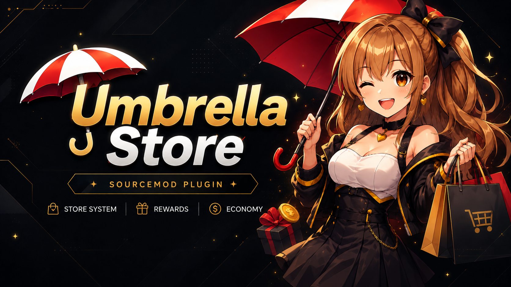

# Umbrella Store

Current package version: `1.4.0`.

Umbrella Store is a modular and modern SourceMod store suite built from the ground up to work as an extensible platform, not just a fixed set of casino plugins.

Unlike many older public store packages, Umbrella Store is not a patched legacy fork. The current codebase is being evolved as a framework-oriented core with a public API, shared persistence layer, item schema v2, Source 1 cosmetic modules, and extension points for third-party modules.

## What Umbrella Store is becoming

This repository now targets three layers:

- `store_core` as the persistent economy, inventory, item, menu, storage, and extension backbone
- first-party modules such as blackjack, crash, roulette, daily, giveaway, camera, player skins, hats, trails, grenade trails, tracers, paintball, say sounds, pets, colored smoke, grenade skins, bullet sparks, laser sights, MVP sounds, sprays, and particles built on top of that backbone
- third-party modules that can integrate through `umbrella_store.inc` without editing the core

## Current architecture highlights

- Public API v7 in [`addons/sourcemod/scripting/include/umbrella_store.inc`](addons/sourcemod/scripting/include/umbrella_store.inc)
- Shared database/storage access exported by the core
- Item schema v2 with backward compatibility for old item configs
- Item metadata is normalized by the core so Source 1 modules can read fields such as `model`, `material`, `color`, `sound`, `effect`, `file`, `duration`, `grenade`, `position`, `angles`, and module-specific options through the public API
- Equipped item enumeration natives for modules that need to scan all active items on a player
- Menu section registration for external modules
- Item type registration for custom module-defined item types
- Pre/post forwards for purchase, equip, trade, credits, and inventory changes
- Source 1 cosmetic item modules for Counter-Strike: Source style entities and temp entities
- Separated module config examples under `addons/sourcemod/configs/umbrella_store/config_examples`
- Optional per-module item config loading from `addons/sourcemod/configs/umbrella_store/items.d/*.txt`
- Cosmetic previews for model, material, smoke, say sound, MVP sound, spray, and particle items from the item details menu
- Persistent client preferences for hiding trails, tracers, paintball impacts, pets, bullet sparks, and particles
- Initial persistent stats and quest progress layers in the core
- `store_daily` refactored to use the core storage layer instead of opening its own database connection
- Module profit leaderboards now available through `!topprofit`, `!topdaily`, `!topbj`, `!topcf`, `!topcrash`, and `!toproulette`
- Daily plus casino sample quests now run on top of the shared quest API
- Built-in `!profile` / `!perfil` and `!quests` / `!misiones` menus on top of the shared stats and quest layers
- Built-in `!tops` / `!leaderboards` menu for all shared rankings
- Built-in `!market` / `!mercado` marketplace for player-to-player item listings, backed by core-owned tables and transaction-safe ownership transfers
- Built-in `!storesearch` / `!buscarstore` item search across item id, name, type, category, description, and rarity
- Built-in `!redeem` voucher redemption for credit and item codes, backed by core-owned voucher tables
- Persistent general audit log through `store_audit_log`, `sm_storeaudit`, and the `US_LogAuditEvent` native for modules
- Transaction-safe credit delta natives for payouts, stakes, rewards, and module storage updates
- Multi-Colors chat backend for richer tag, name, and message color customization across Source engine games
  - Source 2009 games get the broader palette
  - CS:GO uses the classic Multi-Colors color profile, so only its supported subset is guaranteed there
- Optional file-defined quests through `addons/sourcemod/configs/umbrella_store/umbrella_store_quests.txt`
  - supports `title`, `category`, `description`, `goal`, `reward_credits`, `reward_item`, `repeatable`, `max_completions`, `requires_quest`, `starts_at`, `ends_at`, and `enabled`
- Third-party modules can now publish custom stat keys and register their own leaderboard entries in the shared rankings menu
- Profile, export, and quest menus now use batched persistence snapshots instead of many individual SQL reads
- Root admins now have debug/export tooling through `sm_storedebug`, `sm_storequestsdebug`, and `sm_storeexport`

## Included first-party modules

- `store_core`
  - includes the built-in `skin` item type for player skins
- `store_blackjack`
- `store_camera`
- `store_coinflip`
- `store_crash`
- `store_daily`
- `store_giveaway`
- `store_roulette`
- `store_hats`
- `store_trails`
- `store_grenade_trails`
- `store_tracers`
- `store_paintball`
- `store_saysounds`
- `store_pets`
- `store_colored_smoke`
- `store_grenade_skins`
- `store_bulletsparks`
- `store_lasersight`
- `store_mvpsounds`
- `store_sprays`
- `store_particles`

## Extension example

```c
#include <sourcemod>
#include <umbrella_store>

public void OnPluginStart()
{
    US_RegisterMenuSection("my_module", "My Module", "sm_mymodule", 40);
    US_RegisterItemType("player_badge", "cosmetics", true, false);
}

public Action Command_MyModule(int client, int args)
{
    if (!US_IsLoaded(client))
    {
        return Plugin_Handled;
    }

    US_OpenStoreMenu(client);
    return Plugin_Handled;
}

public Action US_OnPurchasePre(int client, const char[] itemId, bool equipAfterPurchase)
{
    return Plugin_Continue;
}
```

## Repository layout

- `addons/sourcemod/plugins`: compiled plugins
- `addons/sourcemod/scripting`: SourcePawn sources
- `addons/sourcemod/scripting/include/umbrella_store.inc`: public include for modules
- `addons/sourcemod/configs/umbrella_store/umbrella_store_items.txt`: item schema examples
- `addons/sourcemod/configs/umbrella_store/items.d`: optional real item config fragments loaded after `umbrella_store_items.txt`
- `addons/sourcemod/configs/umbrella_store/config_examples`: separated examples for each Source 1 cosmetic module
- `addons/sourcemod/configs/umbrella_store/umbrella_store_quests.txt`: optional quest definitions
- `addons/sourcemod/translations`: phrase files

## Requirements

- SourceMod
- SDKTools and SDKHooks, included with SourceMod installs
- SQLite or MySQL, depending on the database entry you configure in `databases.cfg`

## Installation

1. Copy the `addons` folder into the game server.
2. Configure the `store_database` entry in `addons/sourcemod/configs/databases.cfg`.
3. Load the plugins once so SourceMod generates cfg files automatically.
4. Configure the generated cfg files under `addons/sourcemod/cfg/sourcemod`.
5. Replace the examples in `addons/sourcemod/configs/umbrella_store/umbrella_store_items.txt` with your real items.
6. Use `addons/sourcemod/configs/umbrella_store/config_examples` as separated references for player skins, hats, trails, grenade trails, tracers, paintball, say sounds, pets, colored smoke, grenade skins, bullet sparks, laser sights, MVP sounds, sprays, and particles.
7. Put real per-module item files in `addons/sourcemod/configs/umbrella_store/items.d/*.txt` when you want the core to load them separately from `umbrella_store_items.txt`.
8. Add the real model, material, sound, and decal files referenced by your items to the server and FastDL/workshop delivery path used by your server.
9. Optionally add extra quests in `addons/sourcemod/configs/umbrella_store/umbrella_store_quests.txt`.
10. Restart the server or reload the plugins.

## Main docs

- [`MIGRATION.md`](MIGRATION.md)

## New platform-facing commands

- `!topcredits`: global credit leaderboard
- `!topprofit`: global net economy leaderboard
- `!topdaily` / `!topstreak`: best daily streak leaderboard
- `!topbj`: blackjack profit leaderboard
- `!topcf`: coinflip profit leaderboard
- `!topcrash`: crash profit leaderboard
- `!toproulette`: roulette profit leaderboard
- `!tops` / `!leaderboards` / `!rankings`: leaderboard hub menu
- `!profile` / `!perfil`: player summary menu backed by persistent stats
- `!quests` / `!misiones`: quest progress menu backed by the shared quest layer
- `!market` / `!mercado`: built-in player marketplace for browsing, listing, buying, and cancelling listings
- `!storesearch` / `!searchstore` / `!buscarstore` / `!buscar <text>`: searches the item catalog
- `!redeem` / `!voucher` / `!codigo <code>`: redeems a voucher code
- `!profileexport` / `!exportprofile`: exports a text snapshot of your profile under `addons/sourcemod/data/umbrella_store/profile_exports`
- `!hidetrail` / `!hidetrails`: hides local trail rendering for the player
- `!hidetracer` / `!hidetracers`: hides local tracer rendering for the player
- `!hidepaintball`: hides local paintball impact rendering for the player
- `!hidepet` / `!hidepets`: hides local pet rendering for the player
- `!hidebulletspark` / `!hidebulletsparks`: hides local bullet spark rendering for the player
- `!hideparticle` / `!hideparticles`: hides local particle rendering for the player
- `!mvpvolume` / `!mvpvol`: cycles personal MVP sound volume
- Say sound triggers are matched through chat text against owned `saysound` items
- Equipped `spray` items are placed with the use key while aiming at a nearby surface

## Admin tooling

- `sm_storedebug <player>`: prints a persistent economy/profile snapshot for a target to the admin console
- `sm_storequestsdebug <player>`: prints quest state, completion counts, and lock reasons for a target
- `sm_storeexport <player>`: exports another player's snapshot through the shared core exporter
- `sm_storeaudit [target|global] [limit]`: prints recent general audit events from `store_audit_log`
- `sm_createvoucher <code> <credits> [max_uses] [expires_hours]`: creates a credit voucher
- `sm_createitemvoucher <code> <item_id> [max_uses] [expires_hours]`: creates an item voucher
- `sm_disablevoucher <code>`: disables an existing voucher

## Compatibility notes

- This package targets Source 1 / SourceMod servers.
- The new cosmetic modules target Counter-Strike: Source style Source 2009 entities, temp entities, and projectile classnames.
- Chat output is kept compatible with standard Source chat formatting.
- The camera module still depends on thirdperson behavior being allowed by the game/server.
