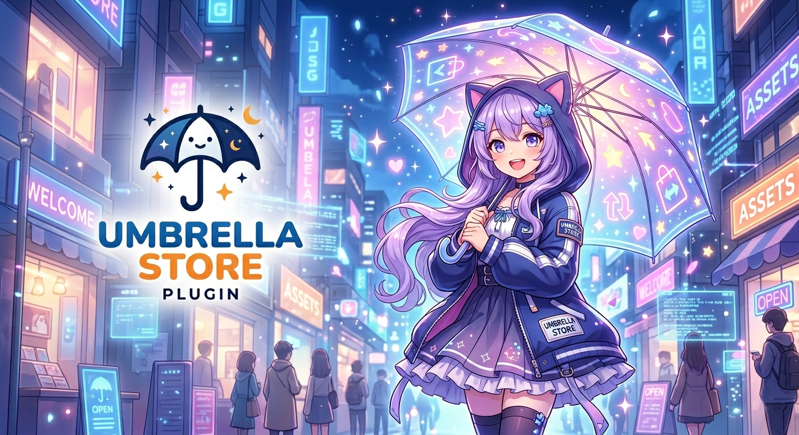

# Umbrella Store



Umbrella Store is a modern, modular SourceMod store built from the ground up as an extensible platform.

Unlike many older public store releases, Umbrella Store is not a patched legacy fork. The project is being evolved around one shared core that owns economy, inventory, persistence, menus, stats, quests, leaderboards, marketplace flows, and public extension points for third-party modules.

## Why Umbrella Store

- built from scratch instead of being another patched legacy store fork
- designed as a real platform with a reusable core and public API
- shared persistence owned by one core plugin instead of scattered module logic
- backward-compatible item config evolution through schema v2
- first-party modules built on the same extension surface available to third parties
- ready for long-term growth through quests, stats, leaderboards, marketplace flows, and module-defined integrations

## 1.1.0 Highlights

Umbrella Store 1.1.0 is the first major framework-oriented release.

- expanded public API v2 in `umbrella_store.inc`
- shared storage layer exported by the core
- item schema v2 with backward compatibility
- persistent stats, quests, quest completion counts, leaderboards, profile menus, and profile exports
- built-in marketplace for player-to-player item listings
- Multi-Colors chat backend with broader Source 2009 color support
- richer default item config with concrete examples plus a ready-to-test Source 2009 color preset
- CI, changelog, contributing guide, architecture docs, API docs, schema docs, and migration docs

## Project Structure

Umbrella Store now works across three layers:

1. `store_core`
   The authoritative backbone for:
   - credits and ledger
   - inventory and ownership
   - item loading and schema validation
   - equip state and exclusivity rules
   - profile, quests, leaderboards, and marketplace
   - shared database/storage access
   - public natives and forwards

2. First-party modules
   Current first-party modules include:
   - `store_blackjack`
   - `store_camera`
   - `store_coinflip`
   - `store_crash`
   - `store_daily`
   - `store_giveaway`
   - `store_roulette`

3. Third-party modules
   Third-party plugins can integrate through `umbrella_store.inc` without editing the core.

## What 1.1.0 Adds

### Core and API

- public API v2 in [`addons/sourcemod/scripting/include/umbrella_store.inc`](addons/sourcemod/scripting/include/umbrella_store.inc)
- menu section registration for external modules
- item type registration for custom item classes
- purchase/equip/trade validation and execution primitives
- shared pre/post forwards for purchase, equip, trade, credits, and inventory changes
- stat key, quest, and leaderboard registration for third-party modules

### Persistence and Storage

- shared DB/storage access owned by `store_core`
- helper natives for DB reuse, escaping, and table bootstrapping
- centralized economy/inventory transaction flow in the core
- `store_daily` refactored to stop bootstrapping its own DB connection

### Item System

- schema v2 fields layered on top of the legacy item config
- support for:
  - `category`
  - `description`
  - `rarity`
  - `sort_order`
  - `icon`
  - `sale_price`
  - `sell_percent_override`
  - `starts_at`
  - `ends_at`
  - `requires_item`
  - `bundle_id`
  - `hidden`
  - `metadata`
- richer default [`umbrella_store_items.txt`](addons/sourcemod/configs/umbrella_store/umbrella_store_items.txt) with:
  - concrete item examples
  - full Source 2009 color preset for tags, namecolors, and chatcolors

### Stats, Quests, and Profiles

- persistent player stats through core-owned tables
- persistent quest progress and completion counters
- quest repeatability, caps, prerequisites, item rewards, and time windows
- built-in `!profile` / `!perfil`
- built-in `!quests` / `!misiones`
- profile exports through `!profileexport` / `!exportprofile`
- admin inspection tools through `sm_storedebug`, `sm_storequestsdebug`, and `sm_storeexport`

### Leaderboards

- built-in shared rankings hub through `!tops`, `!leaderboards`, and `!rankings`
- core leaderboards for:
  - credits
  - profit
  - daily streak
  - blackjack
  - coinflip
  - crash
  - roulette
- support for module-defined stat keys and shared leaderboard registration

### Marketplace

- built-in player marketplace through `!market` / `!mercado`
- listing, browsing, buying, and cancelling flows
- persistent marketplace tables
- transaction-safe credit and ownership changes
- listed items are blocked from equip, sell, gift, and trade until the listing is cancelled or sold
- offline seller handling keeps ledger/stat consistency

### Chat and Colors

- migrated store chat rendering to the Multi-Colors backend
- broader color support for Source 2009 games such as:
  - Counter-Strike: Source
  - Team Fortress 2
  - Half-Life 2: Deathmatch
  - Day of Defeat: Source
  - SDK 2013-based games
- CS:GO uses the classic Multi-Colors subset
- store chat tags, player name colors, and chat colors can now stay equipped together correctly

## Module Overview

### `store_core`

Owns the persistent economy, item catalog, inventory, equip rules, profile system, quests, leaderboards, marketplace, shared menus, and the public API.

### `store_blackjack`

Supports single-player and PvP blackjack while reporting shared stats and quest progress back into the core.

### `store_coinflip`

Simple betting flow with persistent profit/win/loss stats and quest integration.

### `store_crash`

Shared crash rounds with stat/profit tracking and quest progression hooks.

### `store_roulette`

Roulette module integrated with the shared economy, stats, and leaderboards.

### `store_daily`

Daily reward module now built on top of the shared storage layer instead of opening its own database flow.

### `store_giveaway`

Shared giveaway flow for server-side reward events.

### `store_camera`

Utility module for camera, mirror, and first/third-person helper flows where the game/server allows them.

## Public API Example

```c
#include <sourcemod>
#include <umbrella_store>

public void OnPluginStart()
{
    US_RegisterMenuSection("my_module", "My Module", "sm_mymodule", 40);
    US_RegisterItemType("player_badge", "cosmetics", true, false);
    US_RegisterStatKey("my_module_wins");
    US_RegisterLeaderboard("my_module_top", "My Module Top", "my_module_wins", "Top Profit Entry", 80);
}

public Action Command_MyModule(int client, int args)
{
    if (!US_IsLoaded(client))
    {
        return Plugin_Handled;
    }

    US_OpenStoreMenu(client);
    return Plugin_Handled;
}

public Action US_OnPurchasePre(int client, const char[] itemId, bool equipAfterPurchase)
{
    return Plugin_Continue;
}
```

For the full API surface, see [docs/API.md](docs/API.md).

## Repository Layout

- `addons/sourcemod/plugins`: compiled plugins
- `addons/sourcemod/scripting`: SourcePawn sources
- `addons/sourcemod/scripting/include/umbrella_store.inc`: public include
- `addons/sourcemod/configs/umbrella_store/umbrella_store_items.txt`: item config and examples
- `addons/sourcemod/configs/umbrella_store/umbrella_store_quests.txt`: optional quest definitions
- `addons/sourcemod/translations`: phrase files
- `docs`: architecture, API, schema, and migration notes

## Requirements

- SourceMod
- SQL or MySQL, depending on the database entry configured in `databases.cfg`

## Installation

1. Copy the `addons` folder into the game server.
2. Configure the `store_database` entry in `addons/sourcemod/configs/databases.cfg`.
3. Start the server once so SourceMod generates cfg files.
4. Adjust the generated cfg files under `addons/sourcemod/cfg/sourcemod`.
5. Edit `addons/sourcemod/configs/umbrella_store/umbrella_store_items.txt` for your real server items.
6. Optionally define additional quests in `addons/sourcemod/configs/umbrella_store/umbrella_store_quests.txt`.
7. Restart the server or reload the plugins.

## Main Commands

### Player-facing

- `!store`, `!tienda`
- `!credits`, `!creditos`
- `!inv`, `!inventory`, `!inventario`
- `!topcredits`
- `!topprofit`
- `!topdaily`, `!topstreak`
- `!topbj`
- `!topcf`
- `!topcrash`
- `!toproulette`
- `!tops`, `!leaderboards`, `!rankings`
- `!profile`, `!perfil`
- `!quests`, `!misiones`
- `!market`, `!mercado`
- `!profileexport`, `!exportprofile`

### Admin/debug

- `sm_givecredits`
- `sm_setcredits`
- `sm_reloadstore`
- `sm_storedebug <player>`
- `sm_storequestsdebug <player>`
- `sm_storeexport <player>`

## Docs

- [Architecture](docs/ARCHITECTURE.md)
- [API v2](docs/API.md)
- [Item Schema v2](docs/ITEM_SCHEMA_V2.md)
- [Migration Notes](docs/MIGRATION.md)
- [Contributing](CONTRIBUTING.md)
- [Changelog](CHANGELOG.md)

## Build and CI

Local compilation uses the bundled SourcePawn compiler in `addons/sourcemod/scripting/spcomp.exe`.

Example:

```powershell
cd addons/sourcemod/scripting
./spcomp.exe store_core.sp
./spcomp.exe store_daily.sp
./spcomp.exe store_blackjack.sp
```

GitHub Actions also compiles the main plugins on push and pull request events.

## Compatibility Notes

- The current suite has been tested primarily on Counter-Strike: Global Offensive.
- Other Source engine games should be compatible in principle, but still need broader real-world testing.
- Source 2009 games benefit the most from the broader Multi-Colors/MoreColors palette.
- CS:GO keeps the classic Multi-Colors subset.
- `store_camera` still depends on thirdperson behavior being allowed by the game/server.
- Some engine-specific props, such as player arms model handling, are now guarded so unsupported games do not throw runtime errors.

## Project Direction

Umbrella Store is being evolved incrementally with compatibility in mind.

That means:

- old installs should keep working
- old item configs should keep loading
- legacy natives remain available
- new framework-facing integrations should target the v2 API and docs

Feedback, bug reports, feature ideas, and contributions are welcome to keep improving Umbrella Store over time.
